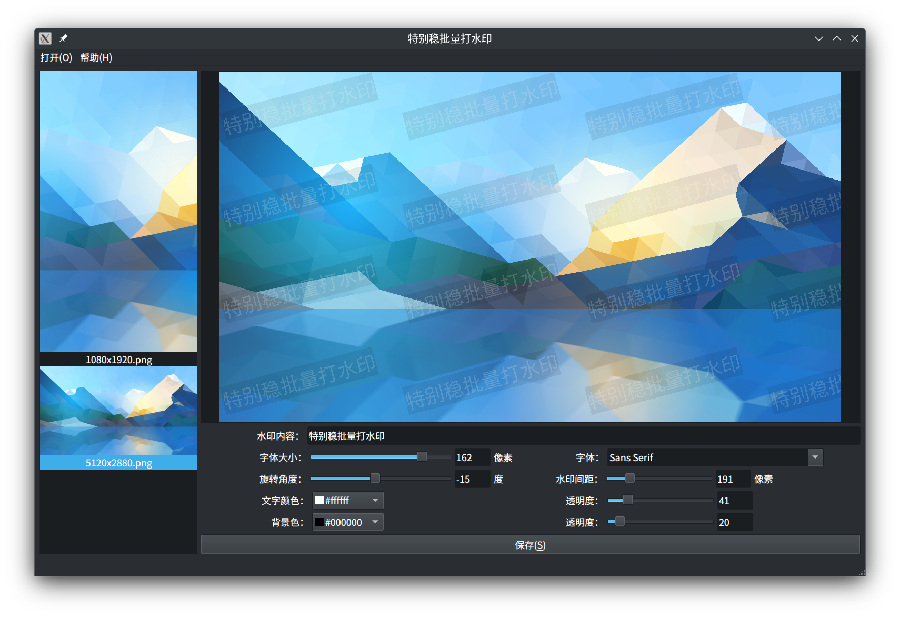

# 特别稳批量打水印

## 1. 介绍

特别稳批量打水印是一个批量给图片添加水印的工具。

以前在统信软件工作的时候，需要帮销售整理应标材料，在 Linux 上找不到好用的批量打水印工具，心心念念。虽然现在已经离开统信，还是写了一个。

本项目采用 QT 开发，支持 Windows、Linux，MacOS 没试过理论上也可以。

本项目采用 GPL3.0 协议。永久开源和免费。

如果这个项目对你带来积极的影响，希望你可以给一个 Star。

## 2. 使用

1. 打开要打水印的图片(支持多选)，或者打开整个图片文件夹。
2. 设置要水印文字以及其他参数。
3. 点击保存，选择要保存的目录。

注意1: 为了防止原图片被修改，只支持保存到其他目录。

## 3. 遗留的一些问题

1. 图片操作现在是单线程，影响性能。
2. 窗口大小改变时候，左侧图片列表和右上角预览框重绘性能不佳。

## 4. 待做事项

- [ ] 1. 打包 DEB 安装包。
- [ ] 2. 打包 RPM 安装包。
- [ ] 3. 打包 Windows MSI 安装包。
- [ ] 4. 优化交互界面。
- [ ] 5. 优化 resize window 时候的性能。
- [ ] 6. 支持多线程。
- [ ] 7. 聚集不多于 3 个代码贡献者。
- [ ] 8. 做大做强，再创辉煌。

## 5. 需要的帮助

1. 希望有兴趣的人可以加入本项目，一起完善。本人联系方式：cst05001 at hotmail.com
2. 做一个程序图标
3. 制作安装包
    1. DEB 格式
    2. RPM 格式
    3. Windows MSI 格式
4. 把本软件加入统信和麒麟的应用商店

